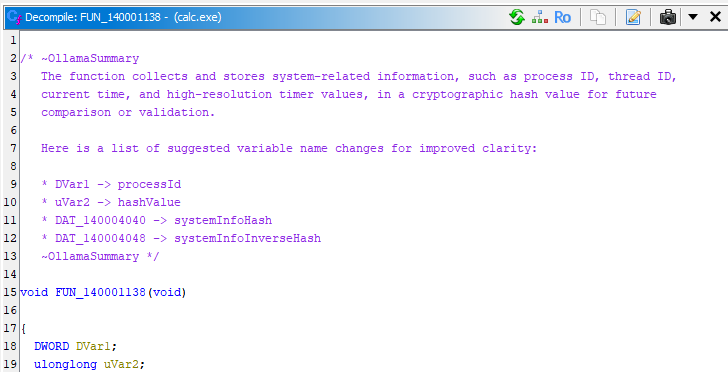

# OllamaGhidra

[](https://opensource.org/licenses/BSD-3-Clause)

A Ghidra extension that interfaces with Ollama to automatically summarize and comment every decompiled function in pseudo-C.



## Features
- Automatically generates high-level function summaries using Ollama
- Creates a list of suggested variable name changes based on function  
- Adds comments directly to Ghidra's function metadata (appears in decompiler view)
- Handles large functions with truncation
- Respects Ghidra's architecture (does not modify decompiler output)
- Configurable Ollama model and token limits
- Preserves existing PLATE comments (the comment at the beginning of the function)  

## Requirements
1. [Ghidra](https://ghidra-sre.org/) (v10.1+)
2. [Ollama](https://ollama.com/) (v0.1.36+)

## Setup

### 1. Install Ollama
Download and install Ollama from https://ollama.com then execute the following:
```bash
ollama serve
ollama pull llama3.2:latest  # Download model (adjust as needed)
```
### 2. Install Jython Dependency
Make sure pip is available and then install the requests library.
```bash
<GHIDRA INSTALL LOCATION>\support\jythonRun.bat -m ensurepip
<GHIDRA INSTALL LOCATION>\support\jythonRun.bat -m pip install requests
```
### 3. Install Ghidra Extension
Place ollama_summarizer.py in Ghidra's script directory:
```<INSTALL LOCATION>\Ghidra\Features\Jython\ghidra_scripts\```

### 4. Run in Ghidra
1. Open a binary in Ghidra
2. Go to File > Script Manager...
3. Select `ollama_summarizer.py` and click Run
4. *Optional*: Select the "In Tool" checkbox, you can run by selecting Comment->OllamaSumary from the tool menu.

## Customization
If necessary, edit the default parameters in `ollama_summarizer.py`:
```python
self.ollama_url = "http://localhost:11434/api/generate" # Ollama API endpoint
self.model = "ollama3.2:latest" # Your preferred Ollama model
self.max_tokens = 1000 # Max tokens for summary
self.timeout = 180 # Timeout for Ollama to respond
self.context_tokens = 65536 # 64k tokens
```
You may need to increase the context_token value if you have a large program, however that has an impact on memory.

## Important Notes
* This does not modify decompiled code - comments appear in Ghidra's metadata (shown in pseudo-C view only).  
* LLM summaries may be inaccurate - always verify with manual analysis.  
* Ollama must be running and the model downloaded before executing the script.  

## Troubleshooting
Troubleshooting
| Issue	| Solution |
| ----- | -------- |
| Ollama connection error | Check ollama serve is running |
| Ollama returns a 404 | Ensure the model is downloaded ```ollama list``` |
| Ollama returns a 500 Server Error | Ensure sufficient memory, decrease the `context_tokens` value |
| No comments added | Ensure function is decompiled (view in Decompiler first) |
| Short summaries | Increase max_tokens in script |
| Rate limiting | Ollama's default rate limit is 1 request/sec |

## License

This project is licensed under the 3-clause BSD License - see [LICENSE.md](LICENSE.md) for details.
